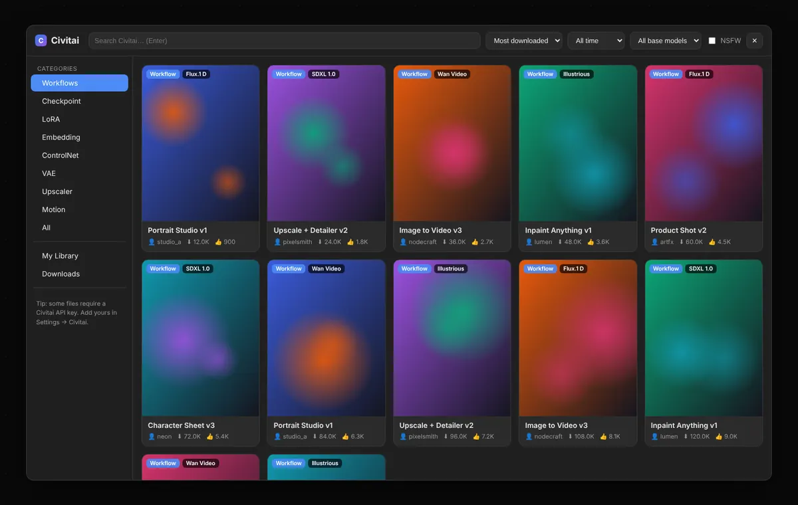
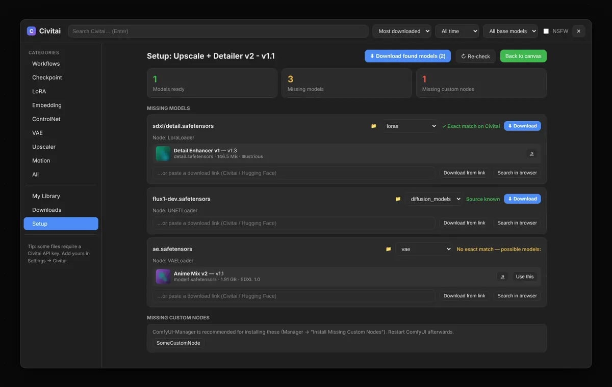

<div align="center">

# ComfyUI Civitai Browser

**Browse Civitai workflows and models right inside ComfyUI, and get any workflow ready to run in one click.**

[](LICENSE)
[](https://github.com/comfyanonymous/ComfyUI)
[](#installation)
[](https://www.patreon.com/cw/FatihCakir)



</div>

---

Finding a workflow on Civitai usually means downloading a zip, unpacking it, dragging the JSON into ComfyUI, and then hunting down every model it needs. **Civitai Browser** turns that into a single click.

It adds a **Civitai** tab to the ComfyUI sidebar, next to Templates, Workflows and Models. From there you can search Civitai, load a workflow onto the canvas, see which models you're missing, and download them straight into the correct folders.

It's a pure frontend + API extension. It **adds no nodes**, **never modifies ComfyUI's core files**, and if it ever fails to load, ComfyUI keeps starting normally. To uninstall, delete the folder.

## Features

### 🔎 Browse Civitai inside ComfyUI
- Categories: **Workflows, Checkpoints, LoRA, Embeddings, ControlNet, VAE, Upscalers, Motion modules**, or everything at once
- Search, sort (most downloaded / highest rated / newest), time period and base model filters
- NSFW filter (off by default; NSFW previews are blurred)
- Infinite scroll, image and video previews
- Detail view with gallery, versions, trigger words (click to copy), files, tags and description

### ⚡ Load & Set Up a workflow in one click
1. Downloads the workflow from Civitai (`.zip`, `.json` or a `.png` with an embedded workflow). If a pack contains several workflows, you pick one.
2. Loads it onto the canvas. UI-format and API-format workflows are both supported.
3. Scans it for every model it references and compares that list with your own model folders (including `extra_model_paths.yaml`).
4. For each missing model, it finds a source:
   - a download URL embedded in the workflow (`properties.models`), or
   - an **exact file name match** on Civitai, or
   - a short list of likely candidates you can choose from, or
   - any link you paste (Civitai or Hugging Face)
   - **or a model you already have**: if you own a similar file (e.g. `juggernautXL_v10` when the workflow asks for `v9`, or an fp8/GGUF variant), **Use mine** points the node at your file instead of downloading anything (with undo)
5. **Download found models** saves everything into the right folder, under the exact file name the workflow expects, so the loaders resolve without any manual re-selecting.
6. Lists missing **custom nodes** and which pack provides each one (from ComfyUI-Manager's node list). **Install with Manager** opens Manager's missing-packs dialog, so the actual install is handled by Manager (folder, Python dependencies, security checks).



### ⬇️ Model downloads
- Each file goes to the folder that matches its type (`checkpoints`, `loras`, `vae`, `controlnet`, `embeddings`, `upscale_models`, …). You can override the folder per file.
- Live progress, speed and cancel. Downloads go to a temporary `.civitai_part` file first, so a broken download never leaves a half-written model behind.
- Existing files are never overwritten.
- Model dropdowns refresh automatically when a download finishes.
- **Add to canvas** drops the matching loader node (Checkpoint, LoRA, VAE, ControlNet, Upscaler) on the canvas, with the new file already selected.

### 📚 My Library
- Every workflow you get from Civitai is saved automatically to `user/default/workflows/Civitai/`. It shows up in ComfyUI's own **Workflows** panel too, so nothing is lost when you close a tab.
- Re-open any of them later with **Open** or **Open & Set Up**.
- **Safe delete**: when you remove a workflow, you can also remove the models that were downloaded *for that workflow* (see [Safety](#-safety) below).

## Installation

### Option 1: ComfyUI-Manager
Open **Manager → Install via Git URL** and paste:
```
https://github.com/fth1905-bot/ComfyUI-Civitai-Browser
```
Then restart ComfyUI.

### Option 2: git
```bash
cd ComfyUI/custom_nodes
git clone https://github.com/fth1905-bot/ComfyUI-Civitai-Browser
```
Then restart ComfyUI.

### Option 3: Manual
Download the [latest ZIP](https://github.com/fth1905-bot/ComfyUI-Civitai-Browser/archive/refs/heads/main.zip) and extract it into `ComfyUI/custom_nodes/`. Make sure you end up with `custom_nodes/ComfyUI-Civitai-Browser/__init__.py`, not a folder nested inside another folder. Then restart ComfyUI.

**No extra Python packages are needed.** The extension only uses `aiohttp` and `Pillow`, which ComfyUI already ships with. It works with the current ComfyUI frontend and with ComfyUI Desktop. On very old frontends without a sidebar API, a floating **Civitai** button appears instead.

## Setting up your Civitai API key (recommended)

Browsing works without a key, but many models and workflows can only be downloaded by logged-in users.

1. On civitai.com, open **Account Settings → Security & Apps → API Keys** and click **Add API key**.
2. Leave **Buzz spend limit** off. This extension never spends Buzz.
3. Copy the key. Civitai only shows it once.
4. In ComfyUI, open **Settings (⚙) → Civitai → Civitai API key** and paste it.

Alternatively, set the key on the server side:
- with the environment variable `CIVITAI_API_KEY`, or
- with a `config.json` file next to `__init__.py` containing `{"api_key": "..."}`.

> The key is only ever sent to `civitai.com`. Downloads from other hosts, such as Hugging Face, never receive it. Treat it like a password. You can revoke it on Civitai at any time.

## Usage

| Where | What |
|---|---|
| Sidebar → **🌐 Civitai** | Opens the browser, plus quick category buttons and your download queue |
| Top menu → **Workflow → Open Civitai Browser** | Same thing, also available as a command |
| Workflow card → **⚡ Load & Set Up** | Download, load, check models and offer downloads |
| Workflow card → **Load only** | Just put it on the canvas |
| Model card → **⬇ Download** | Download a file into the matching folder |
| **📚 My Library** | Every workflow you've downloaded, with Open / Set Up / Delete |
| **Downloads** | Progress, history, cancel |

## 🛡 Safety

Deleting files is the part that should never surprise you, so it follows strict rules.

When you delete a workflow from **My Library**, a confirmation screen lists the workflow and the models that could be removed along with it. Nothing is removed until you confirm, and you choose each model with a checkbox. A model is only offered for deletion if **all** of these are true:

- **this extension downloaded and created the file.** Models you already had, and files that were skipped because they already existed, are never touched.
- **the file hasn't changed since.** Its size is checked; a replaced or modified file is left alone.
- **no other workflow uses it.** Every workflow under `user/default/workflows/` is scanned, and a model used anywhere else is shown as 🔒 *Protected*.
- **it is inside one of ComfyUI's model folders.**

These checks run **again on the server** right before anything is deleted, so even a UI bug can't bypass them. Deleted models are removed permanently (not moved to the Recycle Bin), but you can always re-download them from Civitai.

Like ComfyUI itself, this extension trusts anyone who can reach your ComfyUI server. If you expose ComfyUI to a network (`--listen`), other people on that network can use the browser too, and can read the API key stored in your settings.

## How it works

```
ComfyUI frontend (web/civitai_browser.js)
   │  sidebar tab, browser modal, setup panel, library
   ▼
ComfyUI server routes  /api/civitai_browser/*   (civitai_server.py)
   │  /models  /model/{id}         → proxy to Civitai API v1 (adds your key)
   │  /workflow/fetch              → download + unpack zip/json/png, save to library
   │  /analyze                     → find missing models in a workflow
   │  /download  /downloads        → background downloads into model folders
   │  /library  /library/models  /library/delete
   ▼
civitai.com/api/v1  ·  model folders (folder_paths)  ·  user/default/workflows/Civitai
```

Files the extension creates in its own folder (all git-ignored):
- `downloads_history.json`: finished downloads, used for safe delete
- `library.json`: metadata (thumbnail, model id) for saved workflows
- `config.json`: optional server-side API key

## Troubleshooting

| Problem | Fix |
|---|---|
| No **Civitai** tab in the sidebar | Check that the folder is `custom_nodes/ComfyUI-Civitai-Browser/__init__.py` and restart ComfyUI. Look for `[Civitai Browser] routes registered` in the console. |
| "Unauthorized (401/403)" or "Got an HTML page instead of a file" | Add your Civitai API key, and make sure your Civitai email is verified. Early-access models must be unlocked on civitai.com first. |
| A missing model wasn't found | Civitai's search works on model names, not file names. Use **Search in browser**, or paste a direct download link. |
| Library / delete buttons give an error after updating | Restart ComfyUI. Server-side changes need a restart, and a browser refresh isn't enough. |

## Contributing

Issues and pull requests are welcome. If something breaks, please include your ComfyUI version, your frontend version and the console output (lines starting with `[Civitai Browser]`).

## Support

If this extension saves you time, you can support my work on **[Patreon](https://www.patreon.com/cw/FatihCakir)** ❤️

## License

[MIT](LICENSE) © 2026 Fatih Çakır

*This project is not affiliated with, endorsed by, or sponsored by Civitai. "Civitai" is a trademark of its respective owner. Content you browse and download is subject to each creator's license and Civitai's terms.*
